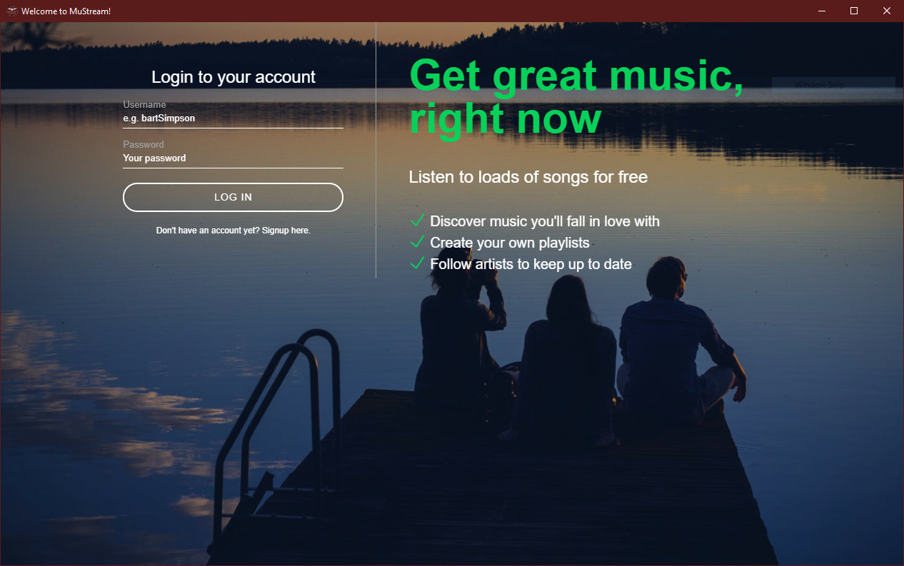

# MuStream
A music streaming web application made using php.
This project was made to include a mp3 player functionality. The whole project was made using CSS, HTML, JavaScript, Php and MySql. 

## Features

* Plays mp3 files.
* Has a shuffle button to randomize the playlist.
* Has a repeat button to repeat the whole playlist or just the single song.
* A login screen to login to account and a sign up feature to create an account.
* An Upload button to upload your song to the database.

## Login Screen

## Player Screen

## Database Schema

